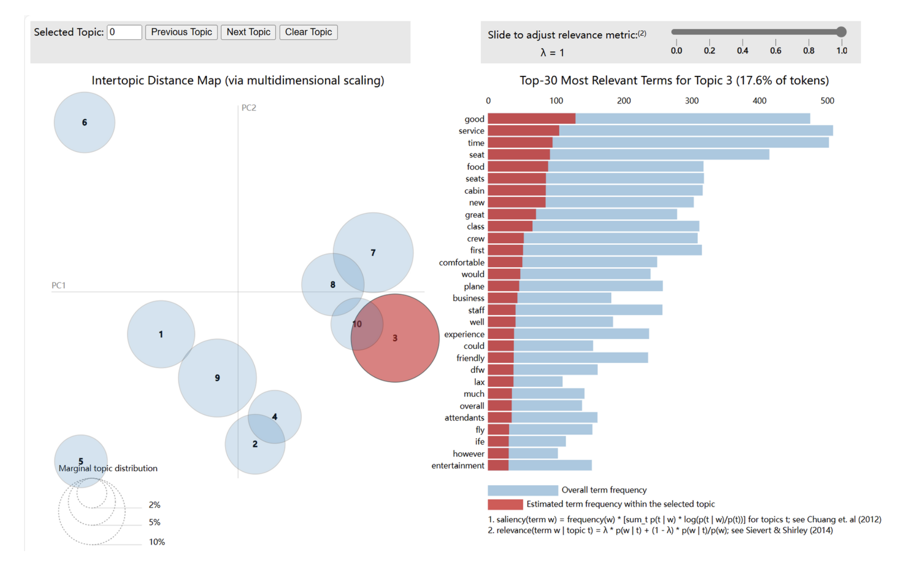
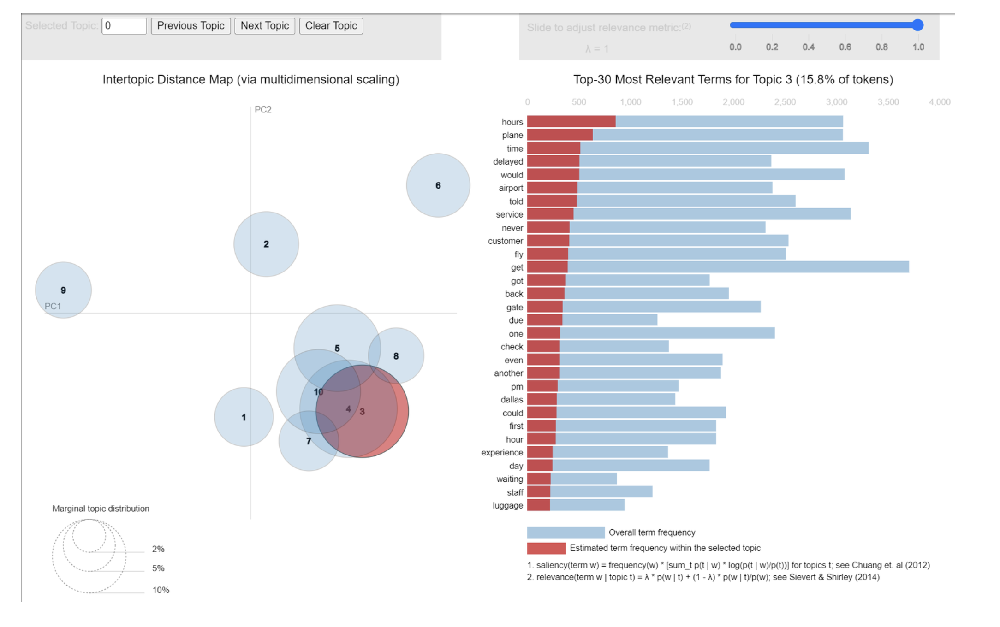
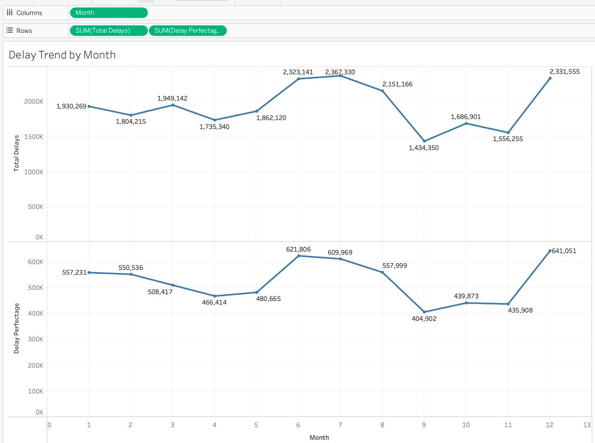
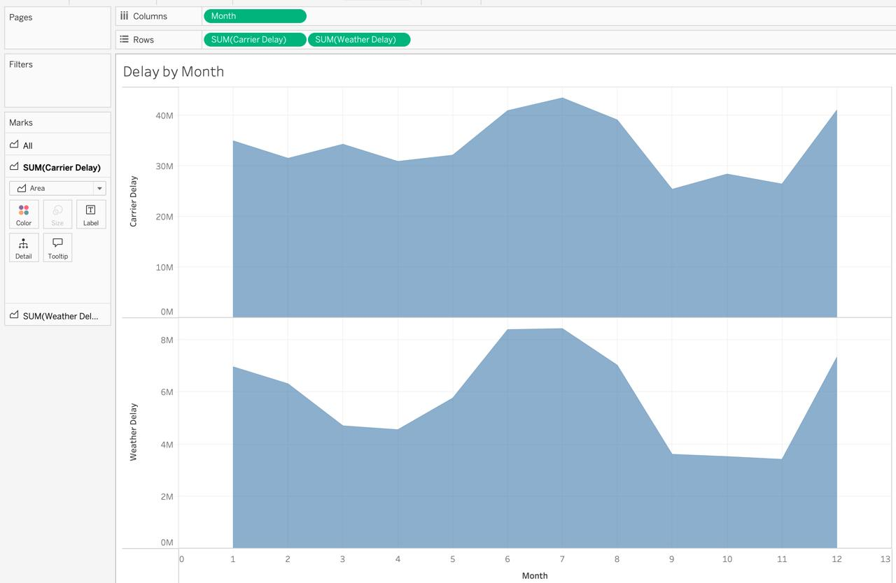
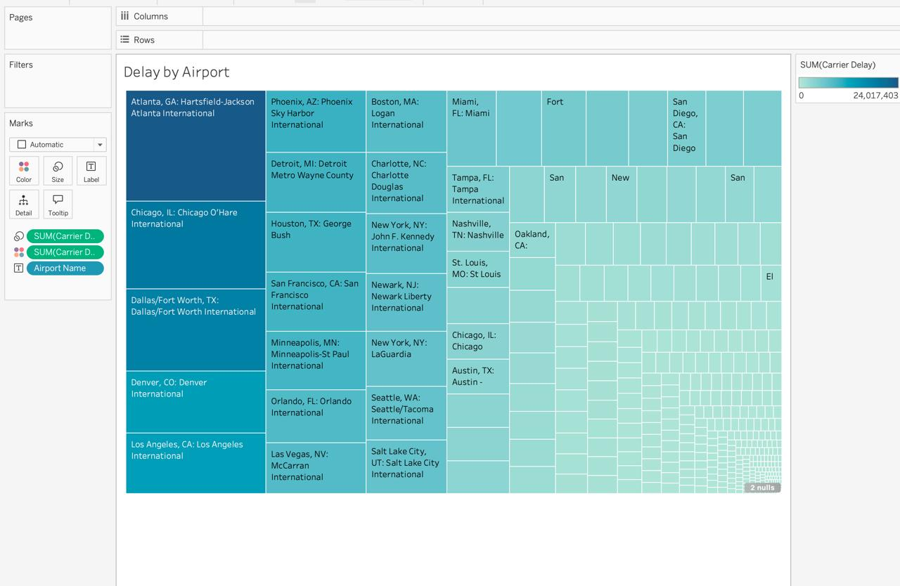
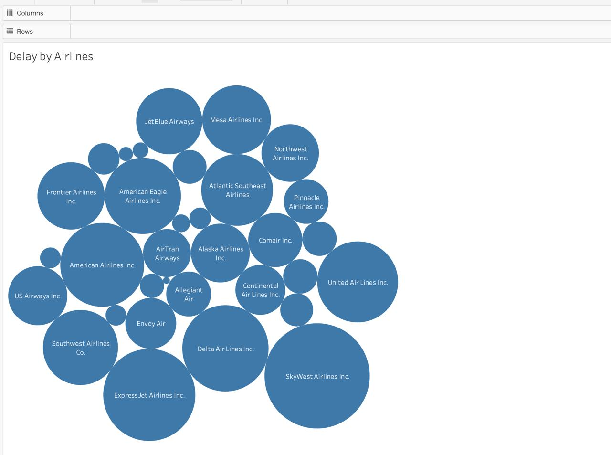

## Summary 
This project bridges the gap between customer reviews and operational performance data to help airlines improve passenger satisfaction and reduce flight delays. Using web scraping, sentiment analysis, and flight delay data, we developed a real-time review monitoring system and proposed strategic insights.

[Download Full Presentation (PDF)](airline_operation.pdf.pdf)

## Data Overview

- Review Source: Skytrax
- Data Type: Text reviews, ratings, recommendations
- Tools Used:
  - Data scraping: `BeautifulSoup`
  - Text Analysis: `NLTK`, `Gensim`, `pyLDAvis`

## Methodology

::: {.columns}
::: {.column width="33%"}
### Data Collection
- Web scraped from Skytrax
- Focused on reviews, dates, ratings
:::

::: {.column width="33%"}
### Preprocessing
- Tokenization
- Lemmatization
- Stopword removal
:::

::: {.column width="33%"}
### Analysis
- LDA Topic Modeling
- Sentiment classification
- Delay pattern visualization
:::
:::

## Topic Modeling

### Positive Review Topics

- Keywords: `good`, `service`, `time`, `crew`, `friendly`, `experience`

### Negative Review Topics

- Keywords: `delay`, `late`, `hours`, `gate`, `rude`, `cancel`

## Delay Pattern Analysis

### Monthly Trends

Delays spike in **July–August** and decline in **late fall/winter**.

### By Cause

- **Carrier delays** dominate over weather and NAS-related issues.

### By Airport

- Major delays at: **Atlanta (ATL)**, **Chicago (ORD)**, **Dallas (DFW)**

### By Airline

- High delay volume: JetBlue, Southwest, United

## Proposed Solution

### Real-Time Review Dashboard

- Flags complaints on delays/service
- Sends alerts to airline staff
- Integrates operational data (delay type, weather)

## Insights & Recommendations

- Prioritize operations in **July–August** for delay mitigation
- Improve **carrier-related logistics** over weather delays
- Use NLP dashboards to **escalate serious complaints**
- Airlines with low delays can serve as **benchmarks**

## Conclusion

By integrating **real-time reviews** and **delay data**, airlines can:
- Respond quicker to passenger pain points
- Predict and prevent operational bottlenecks
- Improve customer satisfaction & brand loyalty