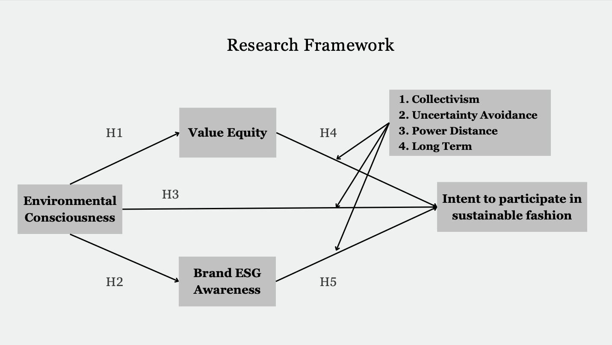

## Summary

This project analyzes the behavioral differences between Eastern and Western consumers—specifically Taiwanese and American—toward sustainable fashion. Using SMARTPLS, it models how ESG awareness, environmental consciousness, and cultural dimensions influence consumers’ intentions to engage in sustainable fashion practices.

## Key Research Focus

- **Variables examined**:
  - Environmental Consciousness
  - Value Equity
  - Brand ESG Awareness
  - Purchase Intention in Sustainable Fashion

- **Cultural Dimensions** (based on Hofstede's theory):
  - Individualism vs. Collectivism  
  - Uncertainty Avoidance  
  - Power Distance  
  - Long-/Short-term Orientation

## Methodology

| Element         | Detail                              |
|-----------------|--------------------------------------|
| Sample          | 200 respondents (Taiwan & USA)       |
| Age Range       | 18–35 (Millennials & Gen Z)          |
| Tool Used       | SMARTPLS (PLS-SEM Modeling)          |
| Design          | Quantitative Cross-Sectional Survey  |

## Research Framework

> *The model investigates how cultural dimensions moderate the influence of consumer behavior variables on sustainable fashion intent.*

  

## Results 

### Reliability & Validity

All constructs in both groups meet the thresholds for:

- **Reliability**: Cronbach’s alpha and composite reliability > 0.7  
- **Convergent Validity**: AVE > 0.5  
- **Explanatory Power**: R² values range between 0.33 and 0.67, indicating moderate predictive strength  

**Eastern**

  
| Factor | Cronbach’s Alpha | Composite Reliability | AVE  | R²   |
|--------|------------------|------------------------|------|------|
| EC     | .843             | .905                   | .761 | —    |
| VE     | .826             | .896                   | .743 | .544 |
| BA     | .901             | .925                   | .713 | .509 |
| IP     | .918             | .938                   | .713 | .759 |

  
**Western**

  
| Factor | Cronbach’s Alpha | Composite Reliability | AVE  | R²   |
|--------|------------------|------------------------|------|------|
| EC     | .843             | .906                   | .762 | —    |
| VE     | .783             | .874                   | .700 | .374 |
| BA     | .909             | .931                   | .731 | .428 |
| IP     | .873             | .913                   | .724 | .614 |

---

### Discriminant Validity

To confirm that constructs are distinct from one another, discriminant validity was assessed using the Fornell-Larcker criterion.  
Diagonal values (in **bold**) represent the square root of AVE, which should be greater than inter-construct correlations.

**Eastern**

  
|        | BA   | EC   | IP   | VE   |
|--------|------|------|------|------|
| BA     | **.844** |      |      |      |
| EC     | .714 | **.873** |      |      |
| IP     | .811 | .754 | **.868** |      |
| VE     | .750 | .737 | .772 | **.862** |

  
**Western**

  
|        | BA   | EC   | IP   | VE   |
|--------|------|------|------|------|
| BA     | **.855** |      |      |      |
| EC     | .639 | **.873** |      |      |
| IP     | .775 | .579 | **.851** |      |
| VE     | .776 | .601 | .643 | **.836** |

---

- **Top influencing factor**:  
  **Brand ESG awareness** strongly predicts sustainable fashion intent, especially in the US group.

- **Other findings**:
  - Taiwanese consumers show slightly higher **environmental consciousness**.
  - American consumers are more influenced by **ESG brand messaging**.
  - Some cultural moderators (e.g., **power distance**) were not statistically significant.
