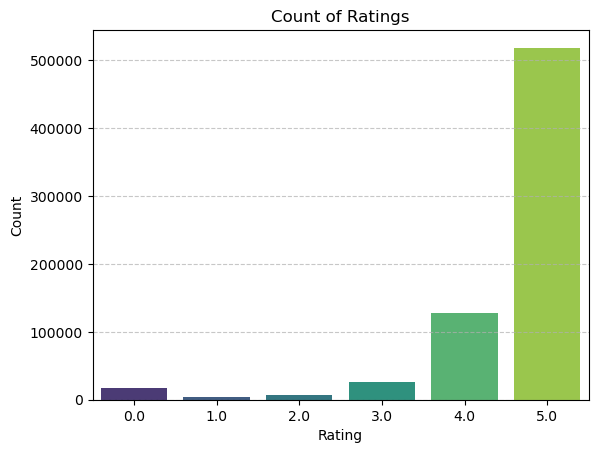
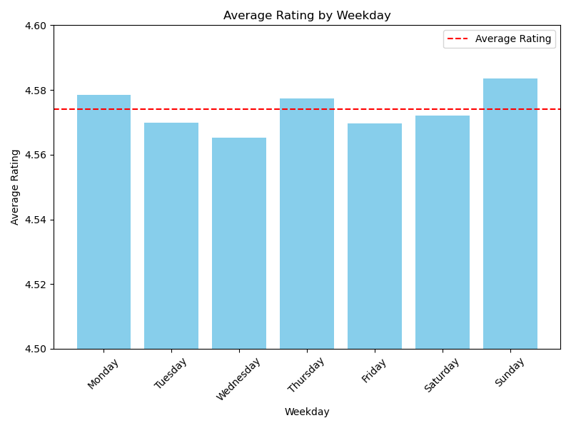
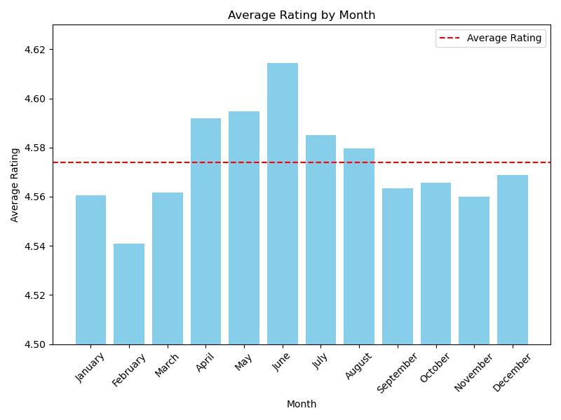
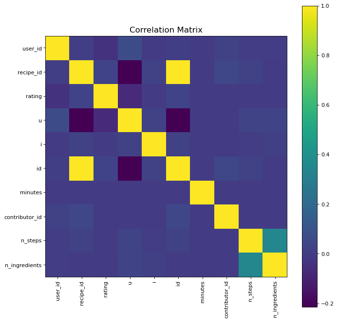

## Summary

This project builds a personalized recipe recommendation system using real user ratings from [Food.com](https://www.food.com). With over 230,000 recipes and 700,000+ user interactions, the goal was to predict ratings and recommend the best recipes using machine learning — particularly **Matrix Factorization**.

[Download Full Report (PDF)](recipe_rating_predict.pdf)

## Dataset Summary

- Recipes: 231,637
- User interactions: ~700,000  
- Split:  
  - Train: 689,901 rows  
  - Validation: 7,023 rows  
  - Test: 12,455 rows

### Key Columns

| Column       | Description                 |
|--------------|-----------------------------|
| `user_id`    | Unique user identifier       |
| `recipe_id`  | Unique recipe identifier     |
| `rating`     | Rating given (1–5)           |
| `date`       | When the rating was given    |

## Exploratory Data Analysis

### Rating Distribution

- Majority of ratings are positive (5 stars)
- Higher ratings occur on weekends, especially Sundays
- June has the highest average rating, while February is lowest

::: {.columns .gap-3}
::: {.column width="33%"}
{width="95%"}
*Rating Count*
:::
::: {.column width="33%"}
{width="100%"}  
*Avg Rating by Weekday*
:::
::: {.column width="33%"}
{width="100%"}  
*Avg Rating by Month*
:::
:::

## Feature Insights

- Key predictors:
  - `n_ingredients`  
  - `n_steps`  
  - `minutes`  
  - `weekday`, `month` (one-hot encoded)

- Correlation heatmaps showed moderate impact from steps/ingredients and minimal impact from IDs

  {width="50%"}  

## Modeling Pipeline

### 1. Baseline (Average Rating)
RMSE: `1.3468`

### 2. Ridge Regression 
- Slight improvement  
- Best RMSE: `1.3465` (validation)

### 3. Random Forest  
- RMSE: `1.3464`  
- Better than Ridge, but still minor gains

### 4. Matrix Factorization (SGD) 
- Best performing model  
- Validation RMSE: 0.6663 at k=9

## Evaluation 

- Matrix Factorization significantly outperforms traditional baselines
- Most useful features: number of ingredients, steps, and time
- IDs had little to no contribution beyond matrix factorization

## Conclusion

This project demonstrates how collaborative filtering techniques like Matrix Factorization can be effectively applied to recipe rating predictions. The strong performance (RMSE ~0.66) highlights its value for personalized recommendations.

> Future work could integrate content-based features like ingredients or cuisine types to enhance recommendations.