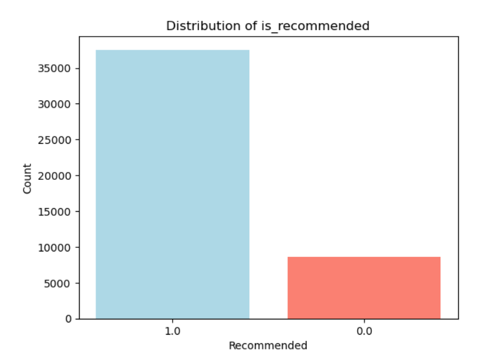
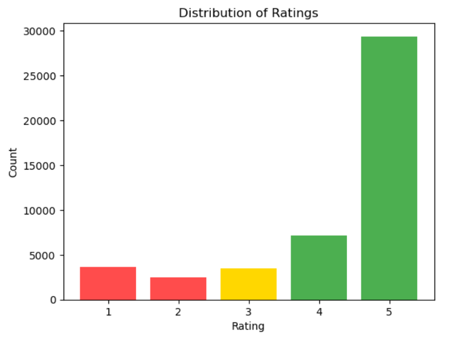

## Summary
Performed sentiment classification on Sephora customer reviews using Natural Language Processing (NLP) to accurately detect positive, neutral, and negative sentiments, addressing challenges such as class imbalance.

[Download Full Report (PDF)](sentiment_analysis.pdf)

## Dataset 

- Size: ~50,000 reviews (structured + unstructured text)
- Sentiment classes: Positive, Neutral, Negative (labeled from 1–5 star ratings)
- Imbalance: Strong positive bias (most reviews are 5 stars)

::: {.columns}
::: {.column width="50%"}

:::

::: {.column width="50%"}

:::
:::

## Methodology

The pipeline was divided into three key stages:

### Preprocessing

- Combined `title` and `review` into `full_review`
- Applied standard NLP cleaning:
  - Lowercased text
  - Removed punctuation
  - Tokenized words
- Removed stopwords and performed lemmatization using **NLTK**
- Mapped sentiment labels:  
  `1–2 → Negative`, `3 → Neutral`, `4–5 → Positive`

### Feature Engineering

Explored multiple vectorization strategies to represent text numerically:

- Count Vectorizer
- TF-IDF Vectorizer
- Word2Vec Embeddings

### Modeling

Used classical machine learning pipeline with the following configuration:

- Algorithm: Logistic Regression
- Cross-validation: Stratified K-Fold
- Hyperparameter tuning: GridSearchCV
- Class imbalance handling: `class_weight="balanced"`

## Results

| Model            | Accuracy | Macro-F1 | Precision | Recall |
|------------------|----------|-----------|-----------|--------|
| Count Vectorizer | 84.3%    | 0.652     | 0.70      | 0.63   |
| TF-IDF           | 81.9%    | 0.680     | 0.68      | 0.68   |
| Word2Vec         | 73.5%    | 0.510     | 0.60      | 0.49   |

TF-IDF achieved the best macro-F1 score, reflecting its ability to balance predictions across all sentiment classes despite strong class imbalance.

## Key Insights
- Top NLP methods: Count Vectorization achieved highest accuracy (84.3%), but TF-IDF provided superior balanced performance (Macro-F1: 0.680), crucial given significant class imbalance.
- Identified challenges with Word2Vec due to limited dataset size, resulting in lower performance.
- Highlighted the importance of macro-F1 as a more reliable metric than accuracy alone for sentiment analysis.

## Technical Highlights
- Employed Python extensively (Pandas, NumPy, Scikit-learn, NLTK, Gensim).
- Conducted comprehensive data preprocessing, including tokenization, lemmatization, and stop-word removal.
- Used GridSearchCV and Stratified K-Fold Cross-Validation for robust model tuning and validation.

## Result
This project demonstrated a practical pipeline for sentiment classification using real-world product review data. Despite strong class imbalance, models like TF-IDF with Logistic Regression yielded strong macro-F1 performance.

**Key takeaways**

- Simple vectorizers can outperform deep embeddings (e.g., Word2Vec) in small datasets.
- Macro-F1 is a more reliable metric than accuracy when class imbalance exists.
- Future work could explore more advanced NLP methods (e.g., BERT) or address imbalance with SMOTE or focal loss.