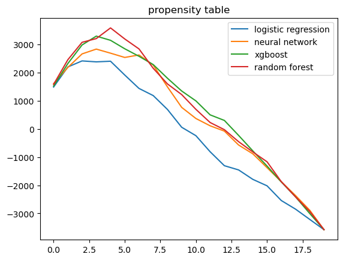
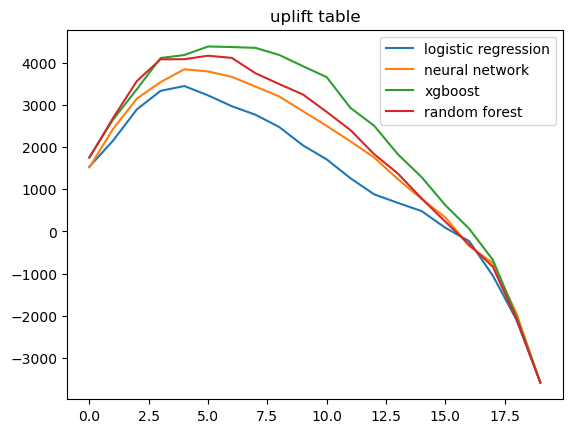

## Summary
This project applies uplift modeling to optimize customer targeting for a fashion gaming campaign. The goal is to identify which customers are truly influenced by ads and maximize incremental conversion and revenue. This approach improves upon traditional **propensity-to-buy** models by estimating **causal impact**.

[Download Full Report (PDF)](Creative%20Gaming%20Uplift%20Modeling.pdf)

## Objectives
- Apply machine learning techniques to uplift modeling  
- Compare uplift with propensity models  
- Identify most profitable customers to target  
- Determine the optimal targeting proportion

## Data Preparation
- Two datasets:
  - `cg_organic_control`: 30,000 untreated customers
  - `cg_ad_random`: 30,000 ad-exposed customers  
- Merged into `cg_rct_stacked` with new binary column `ad`
- Split into train/test (70/30) stratified by `converted` and `ad`

## Result and Comparison
I tested four models to predict uplift:

| Model               | Uplift Profit | Propensity Profit | Uplift Gain |
|--------------------|---------------|-------------------|-------------|
| Logistic Regression| 45,908        | 32,065            | 13,842      |
| Neural Network     | 51,194        | 35,878            | **15,316**  |
| Random Forest      | 54,374        | 47,697            | 6,677       |
| **XGBoost**        | **55,694**    | **41,966**        | 13,728      |

Each model produced uplift and profit curves.  
The **best result came from XGBoost**, outperforming both baseline and other ML models.

::: {.columns .gap-3}
::: {.column width="50%"}
{fig-align="center" width="100%"}
:::
::: {.column width="50%"}
{fig-align="center" width="100%"}
:::
:::

> The uplift model significantly outperforms the propensity model, especially in top deciles where most persuadable users reside.

## Key Insights

- Uplift modeling identifies customers who change behavior _because of the ad_
- Propensity modeling includes users who would have converted anyway
- Uplift leads to higher incremental revenue and better cost-efficiency

> *Maximum uplift profit achieved*: **$58,395.95** using **XGBoost**

